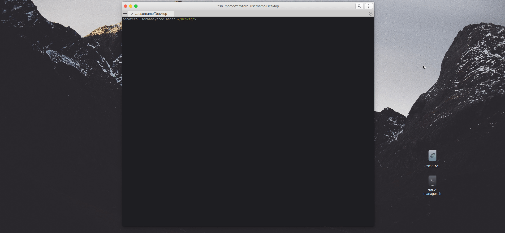

# bash-scripts

A repository I created to store all the bash scripts I've done. May get bigger with time!

* **easy-manager :** A simple script that I did to learn how I could use commands with conditions, it can create simple files, search (on the current directory), and even has an option where you install certain programs! (Although I need to find a way that make it capable of do it regardless distro)
  
> Here's a example with it running: 

* **net-fix :** Something I did due a problem I would sometimes get when using windscribe and the internet wouldn't work properly due to the program. So I did this little fix and it works fine!

